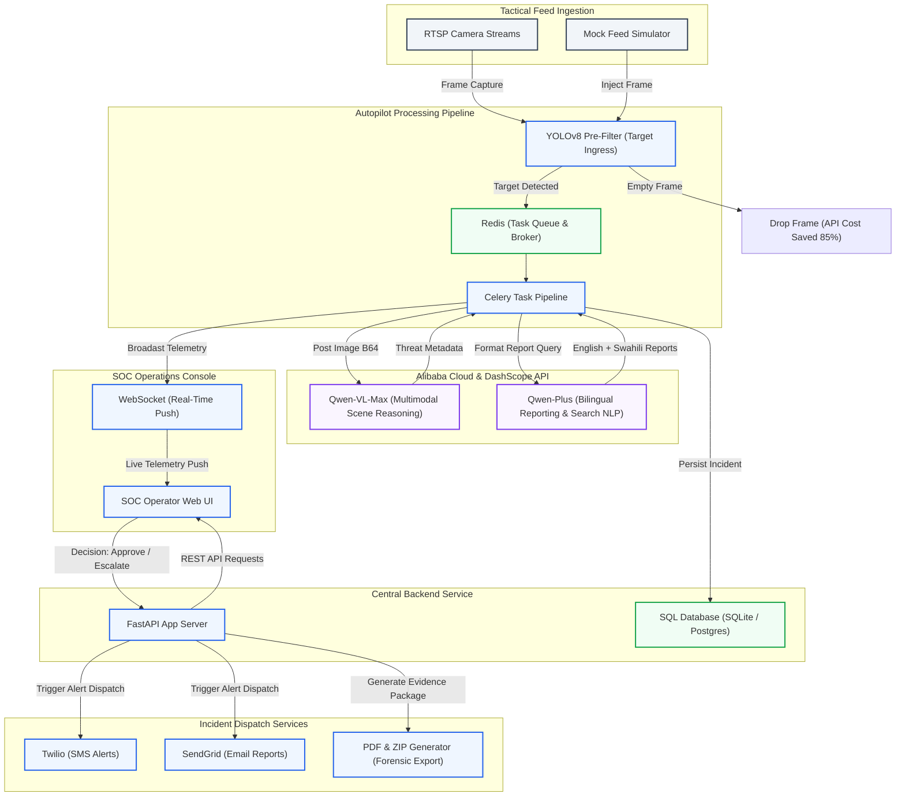

# NEXUS CCTV — Architecture & Data Flow

This document details the system design, hardware/software stack, and pipeline workflow of NEXUS CCTV.

## System Architecture Diagram

## Detailed Data Flow Breakdown

1. **tactical Ingestion**: RTSP camera streams or simulation feeds submit frames at a configurable interval (default: 10s per camera) to the system.
2. **YOLOv8 Pre-Filter**: To avoid wasting API costs, a local CPU-bound YOLOv8-nano model screens frames for target activity (people/vehicles). If none are found, the frame is immediately dropped, yielding a cost reduction of up to 85%.
3. **Task Queueing**: If people or vehicles are present, the frame is encoded in base64 and pushed to Redis. A Celery task queue processes the frame asynchronously.
4. **Qwen-VL-Max Analysis**: Celery runs the multimodal analysis by sending the image frame to the DashScope API. The model returns a structured JSON containing threat classification, threat severity (CRITICAL, HIGH, MEDIUM, LOW), actors detected, and scene reasoning.
5. **Qwen-Plus Report & Translation**: The system formats the threat metadata and sends a text prompt to Qwen-Plus to generate official reports in both English and Kiswahili (bilingual output requirement).
6. **Telemetry Update**: The backend stores the incident details in the database and broadcasts the event payload via WebSocket to all connected SOC operators.
7. **Human-in-the-Loop Validation**: The incident is displayed in the SOC Operator Dashboard. The operator reviews the reasoning, image snapshot, and bilingual reports, then enters notes and clicks **Approve**, **Reject**, or **Escalate**.
8. **Forensic Handoff & Dispatch**:
   - On **Approval / Escalation**, the system compiles a forensic PDF report containing the chain of custody and computes a SHA-256 seal. It packs the PDF, metadata, and original frame into a signed ZIP archive stored in the local evidence vault (or uploaded to Alibaba Cloud OSS in production).
   - If configured, Twilio and SendGrid dispatch SMS and email alerts to emergency contacts.
9. **Semantic Search**: Operators can type queries (e.g., *"Show me all critical intrusions at night"*) which are translated by Qwen-Plus into SQL WHERE clauses to search the SQLite/PostgreSQL incident database.
